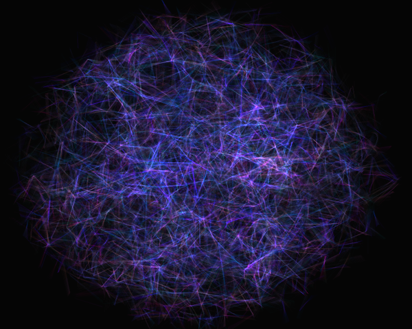
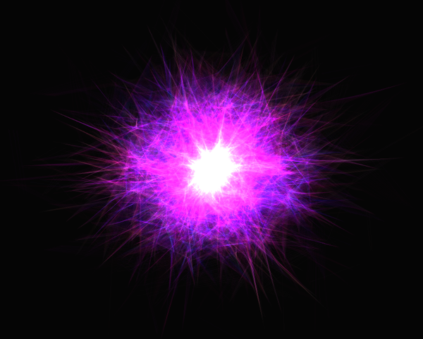
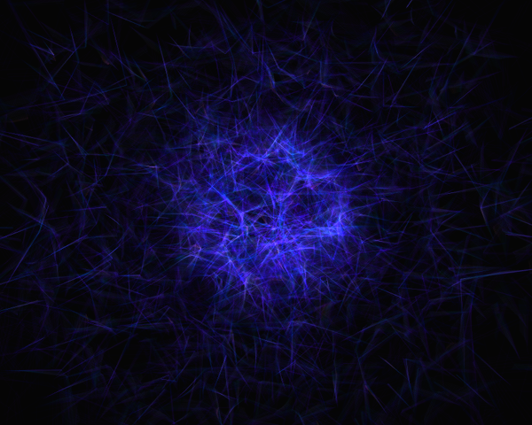
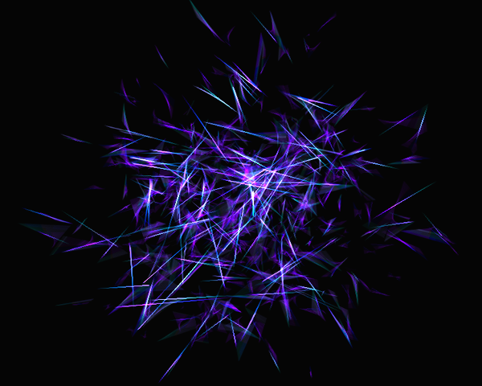
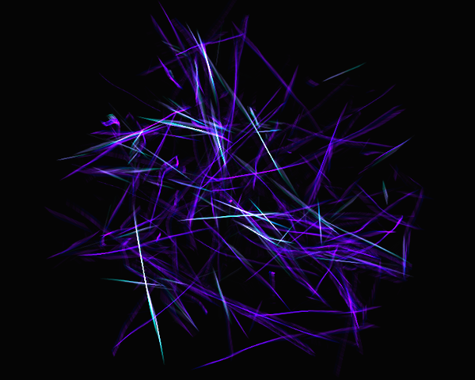
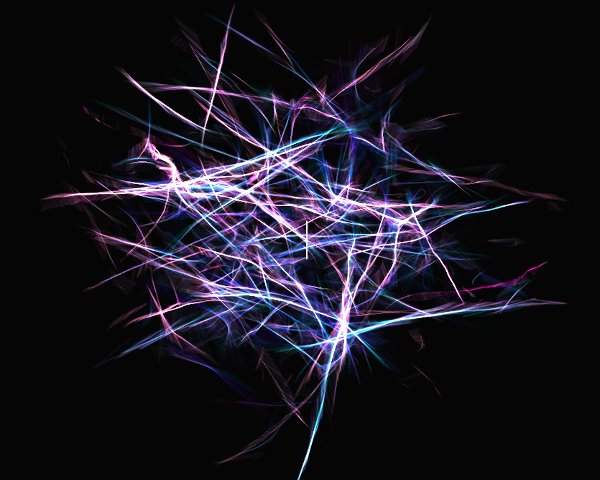

# process-3d
3D Software Interpretation of Reas's Processes

Original work: http://reas.com

Writeup: https://github.com/sharkgoesmad/cs526-research-journal/blob/master/term-paper/reas3d.pdf

Showcase Video: https://vimeo.com/148956141

Screenshots
-----------

